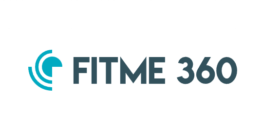
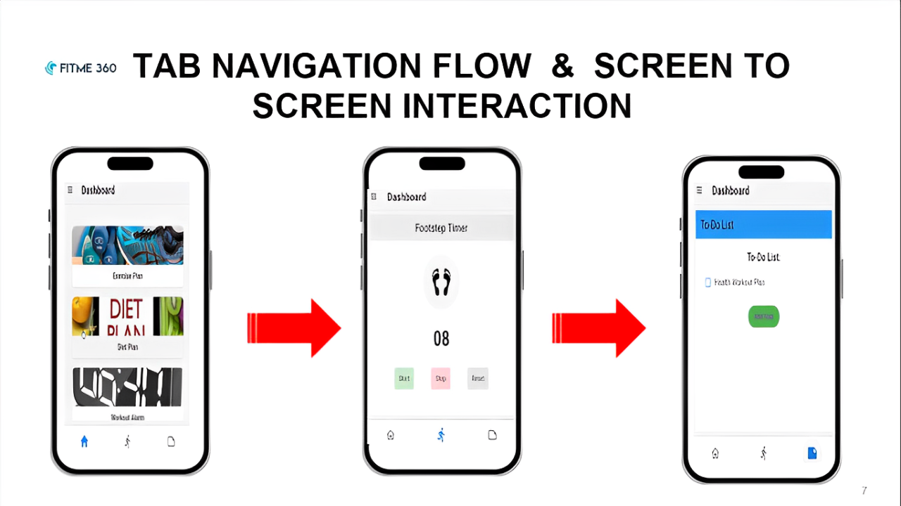
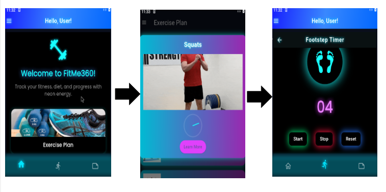

# FitMe360

##  Hi
I have created a fitness application in my 3rd Semester. 
# Application:
FitMe-360
# Health Awareness Application
# Objective:

The main objective of this application is to spread awareness about health and fitness. It encourages people to eat healthy food, stay active, and maintain a balanced lifestyle.

# Features

This application provides several useful tools to help users stay healthy and organized:

Alarm – Reminds users of important activities like workouts or meals.

Exercise Plan – Offers structured workout plans to improve fitness.

Diet Plan – Suggests healthy meals and nutrition tips.

Footstep Timer – Tracks walking steps and activity time.

About Section – Explains app usage and purpose.

Additional utilities to support a healthy lifestyle.

Versions

Initial Release – First version with core features (alarm, diet plan, exercise plan, etc.).

Updated Version – Improved design, added new features, and fixed bugs for better user experience.

Open Source

This is an open-source project. Contributions are welcome to improve features, design, or performance.
# Version 1.0

## UPDATED VERSION OF APPLICATION
# Version 1.1

## Features

- Track workouts
- Monitor progress
- Get personalized tips
